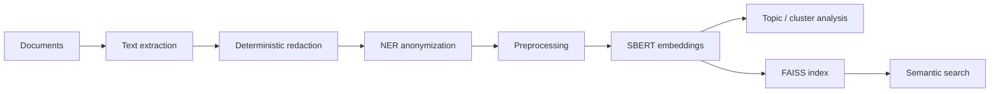

# Judicial NLP & RAG Lab

[](https://github.com/alanbadenas/judicial-nlp-rag-lab/actions/workflows/python-ci.yml)

Academic Master's coursework project exploring **NLP, embeddings, clustering/topic modeling, anonymization, and semantic retrieval** over legal/technical text.

> **Portfolio classification:** academic / research prototype — not commercial experience.
>
> **Public-data policy:** this repository contains **synthetic examples only**. Real case records, identifiers, API keys, embeddings, models, indexes, notebook outputs, and any derived artifacts from working datasets are intentionally excluded.

## What this project demonstrates

- Python-based document/NLP pipeline design;
- deterministic privacy pre-redaction plus contextual NER anonymization;
- Sentence-BERT embeddings;
- UMAP, HDBSCAN and BERTopic experiments;
- FAISS-based semantic retrieval / RAG-oriented indexing;
- Streamlit visualization and interactive querying;
- separation between source code and sensitive/generated data.

## Architecture



More detail: [`docs/architecture.md`](docs/architecture.md).

## Repository layout

```text
src/                    Core NLP, anonymization, embeddings and RAG utilities
scripts/                Exploratory analysis scripts
data/synthetic/         Fictional text samples safe for public demos
tests/                  Privacy regression tests
streamlit_rag_app.py    Interactive retrieval/visualization prototype
rag_demo.py             CLI demo for index build and query
PRIVACY.md              Public data-handling rules and limitations
```

## Quick start

```bash
python -m venv .venv
# Linux/macOS: source .venv/bin/activate
# Windows: .venv\\Scripts\\activate
pip install -r requirements.txt
pytest -q
python rag_demo.py build data/synthetic index
python rag_demo.py query index "What technical failure is described?" --top_k 3
```

To launch the UI:

```bash
streamlit run streamlit_rag_app.py
```

## Optional Gemini path

Some exploratory code supports Gemini-assisted extraction. Keep credentials only in a local `.env` created from `.env.example`. **Never commit keys or upload sensitive case documents to an external API without an appropriate data-governance basis.**

## Privacy design

The public version intentionally starts with a deterministic standard-library redaction pass for structured identifiers (CNJ-style process number, CPF, CNPJ, e-mail, phone and date patterns) before optional model-based NER. See [`PRIVACY.md`](PRIVACY.md) for limitations.

## Academic context

The original coursework investigated data-science techniques applied to legal/technical documents relevant to engineering analysis. The public portfolio version was rebuilt from a clean Git history so that documents and derived data from the academic working environment are not recoverable from repository history.

## Automated checks

GitHub Actions performs lightweight Python syntax compilation and privacy regression tests on every push and pull request. The CI intentionally avoids installing the full ML/NLP stack so that repository health checks remain fast and deterministic.

## Current limitations

- anonymization is a research safeguard, not a production privacy guarantee;
- model downloads make the full stack relatively heavy;
- the Streamlit and clustering paths remain exploratory rather than production services;
- no real legal dataset is distributed with this repository.

