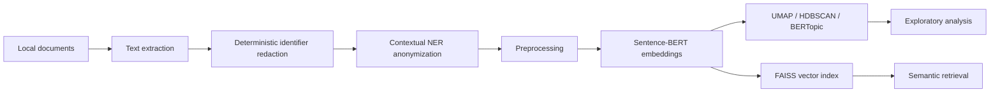

# Architecture

The public demo uses synthetic `.txt` files. Optional PDF and LLM-assisted paths are retained as academic experiments but should not be used with sensitive documents without a separate privacy/security review.
